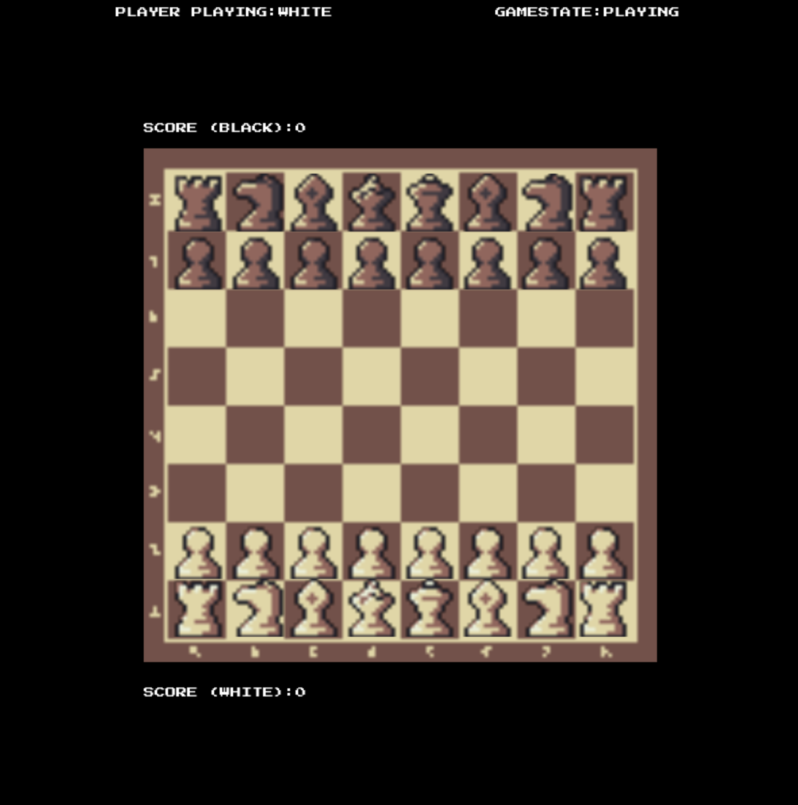
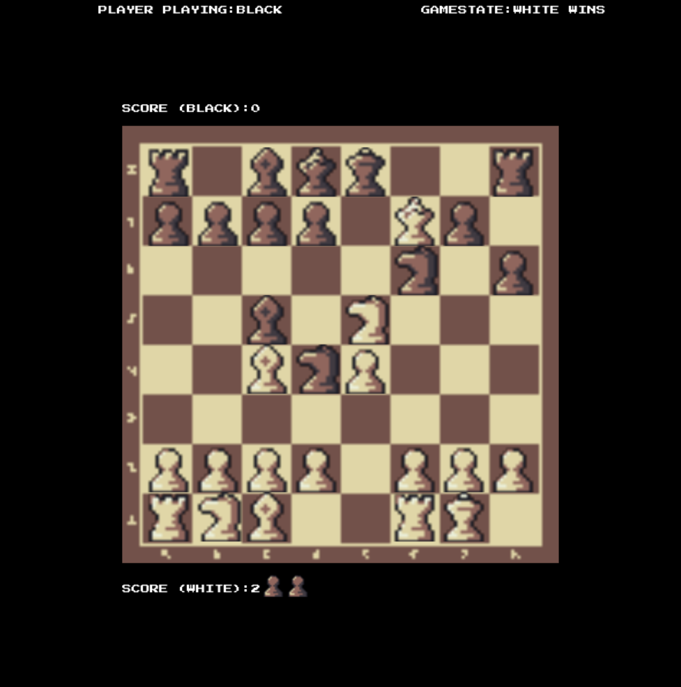
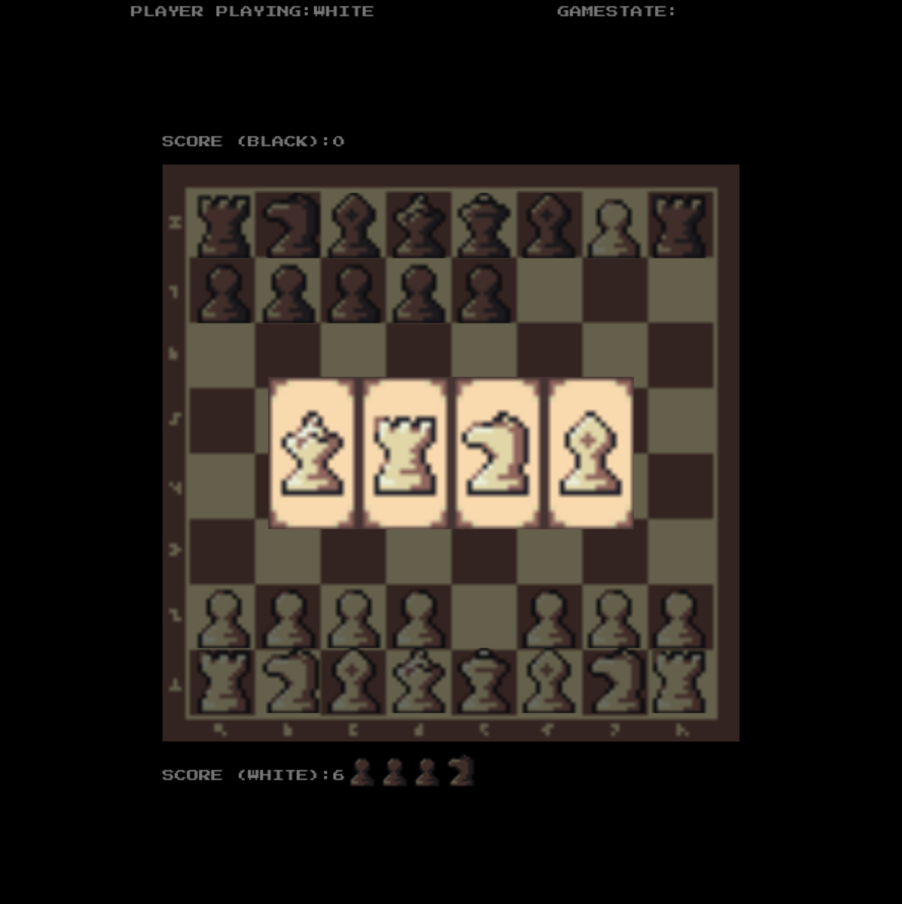
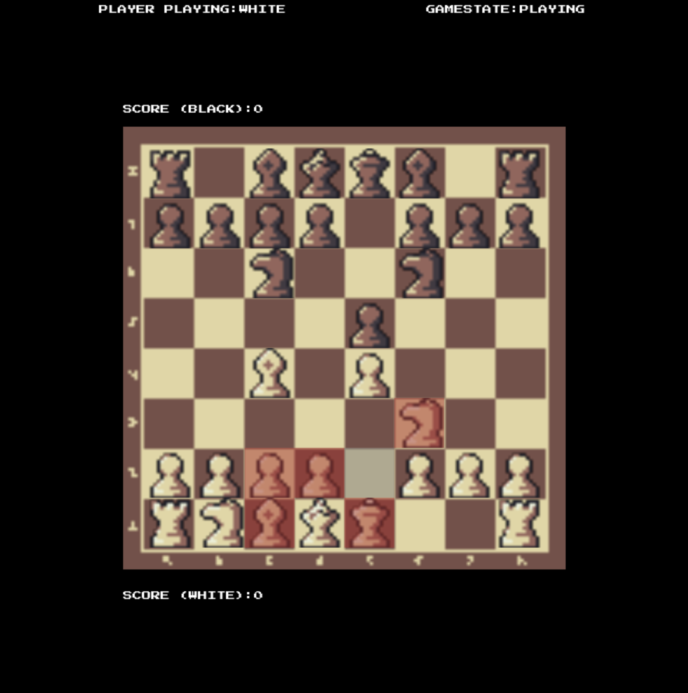
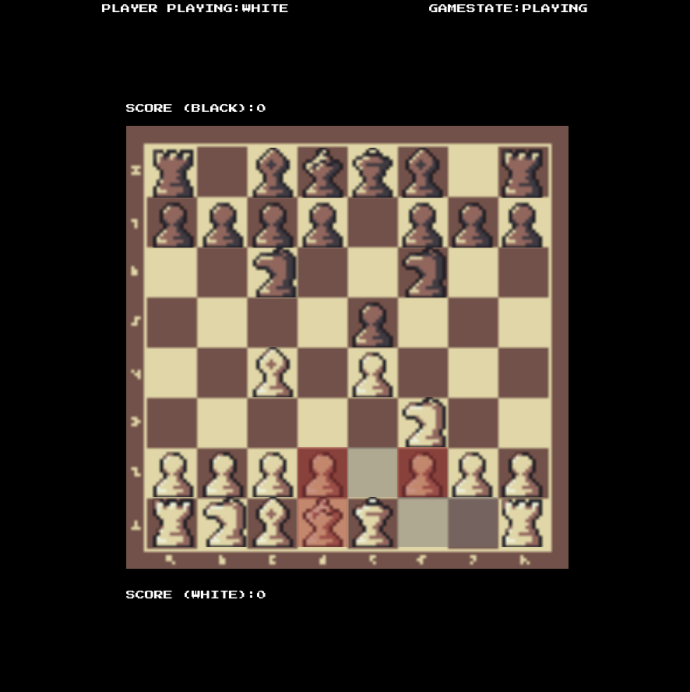
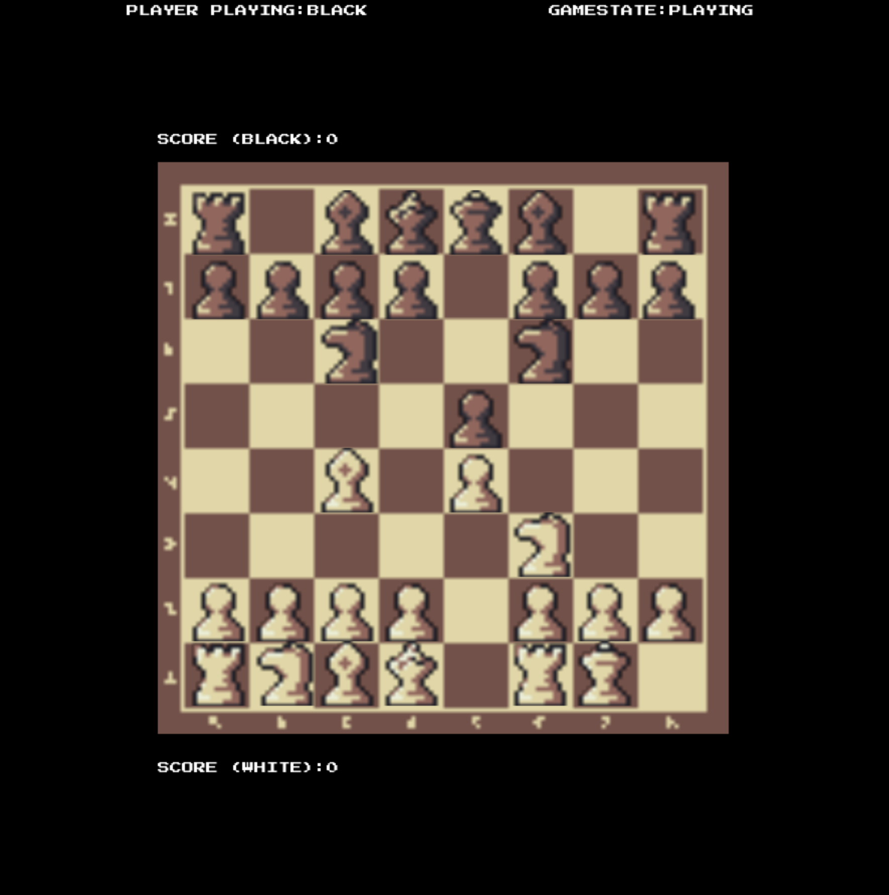
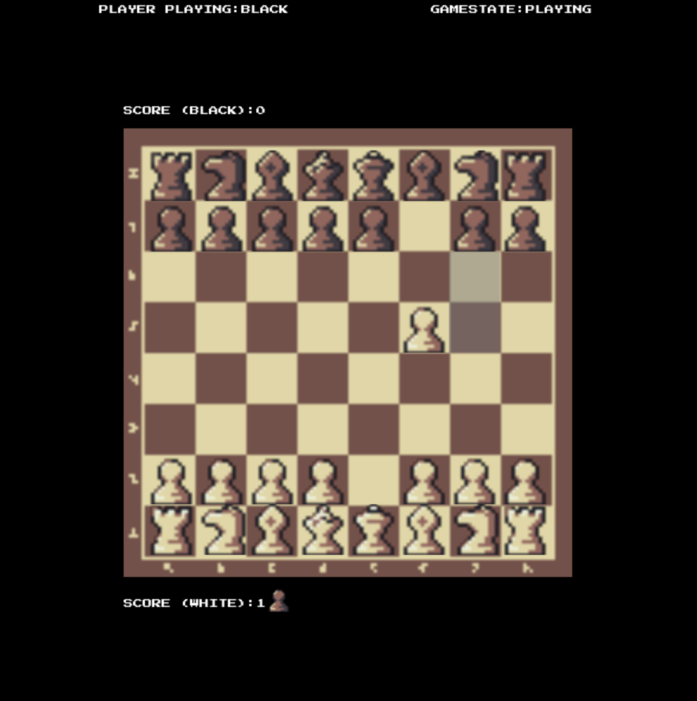
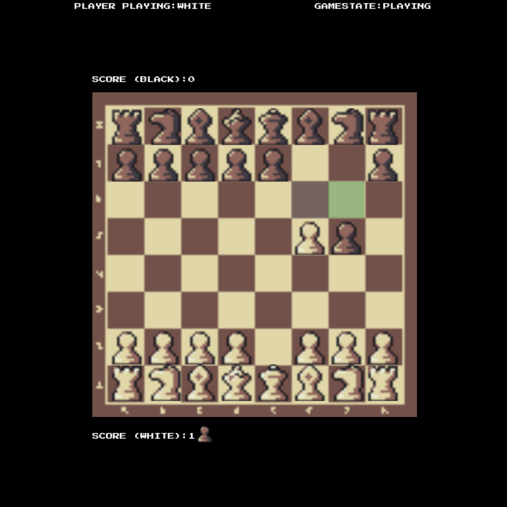
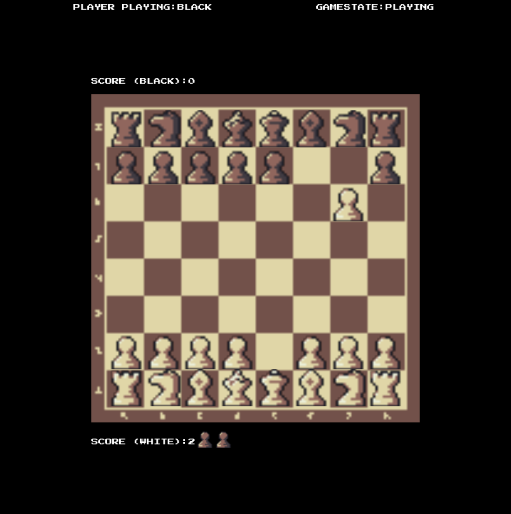

# Chess in Python 

## Tech Stack
- Python
- Pygame

Textures used are from public website

## Features Introduced:
  - Game-state status
  - Player-playing status
  - Rule enforcement:
    - Pins
    - Castling
    - En Passant
    - Check / Checkmate
    - Pawn Promotion
    - Stalemate

## Move Validation
 - Illegal moves are prevented, a move is rejected if it leaves the king in check

## Move Visualization

- 🔴 Red → illegal move (own piece / invalid)
- ⚪ Grey → valid move
- 🟢 Green → valid capture

## Examples

**Initial Board**

**Checkmate Example**

**Pawn-Promotion**

**Piece(Queen) Legal Moves Example**

**Castle**

**En-passant**

## Implementation

- Object-oriented design with classes for Pieces, Tiles, Board, etc.
- Central `Tools` class used as a shared utility container
- Initialization handled in `initialization.py`
- Game loop manages events and state transitions
- Move generation handled per piece
- `IsAttacked` checks if a tile is under threat
- `GameFunctions` handles:
  - Checkmate / Stalemate
  - Pawn Promotion
  - Delta time
  - Dispatching logic
- Constants file stores enums and rendering assets

