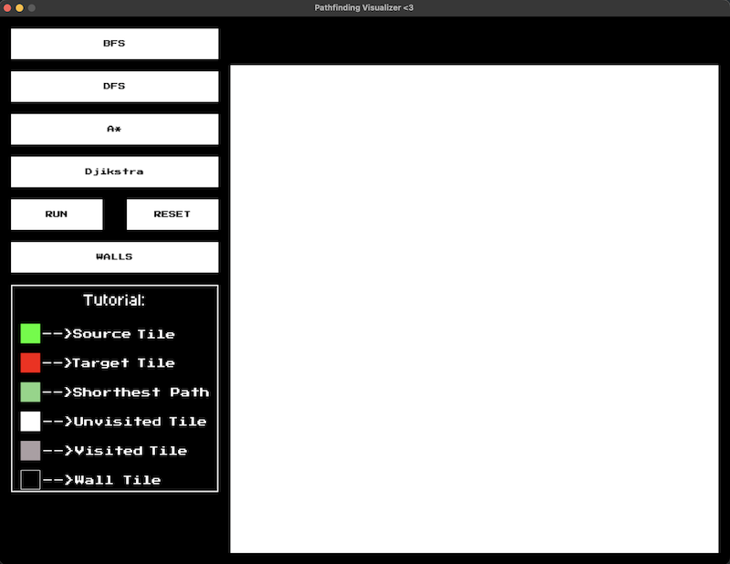
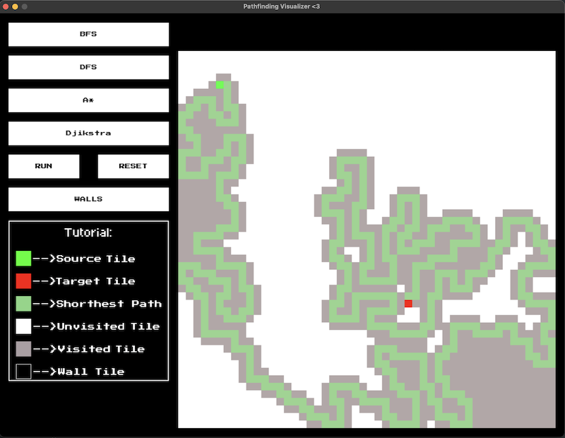
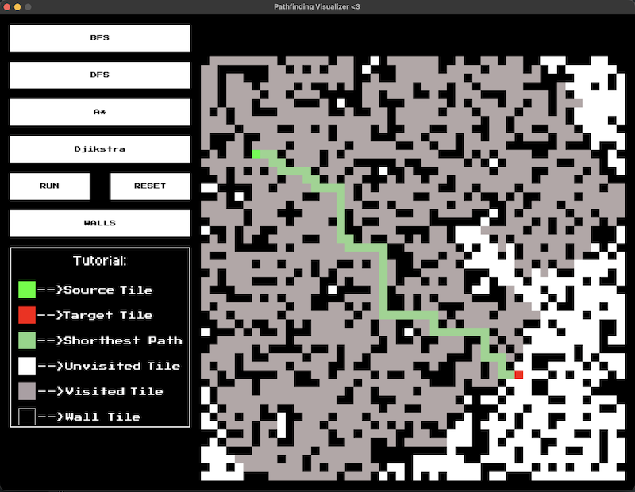
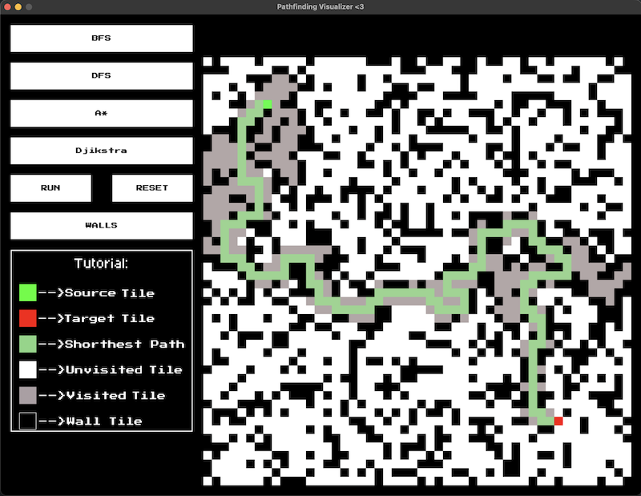
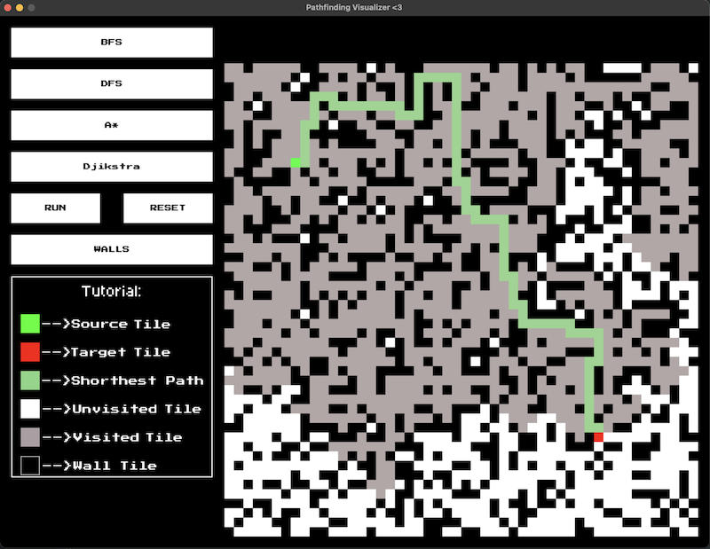
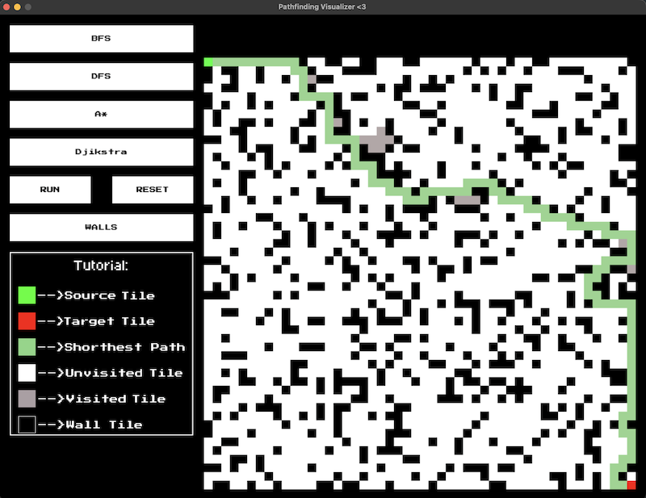

# Pathfinding Visualizer
A Simple GUI built in Python (pygame) in order to illustrate
how certain pathfinding algorithms find shortest path

# Tech Stack
- Python
- pygame

Textures used are from public website

## Features:

## Algorithms
- Breadth First Search (BFS)
- Depth First Search (DFS)
- A* 
- Djikstra

## Interactive Buttons
- Run ( Runs the pathfinding algorithm)
- Reset ( Resets the whole canvas )
- Walls ( Puts walls on canvas )
- Algorithm Buttons Selection

## Error Handling
- Insufficient requirements in order to run the algorithm
- Must use brush after algorithm run 

## Tutorial
- Simple Picture explaining how to use GUI

## Examples / Pictures

**User Interface**

**Simple DFS Run**

**BFS with Walls**

**DFS with Walls**

**Djikstra with Walls**

**A_star with walls**

