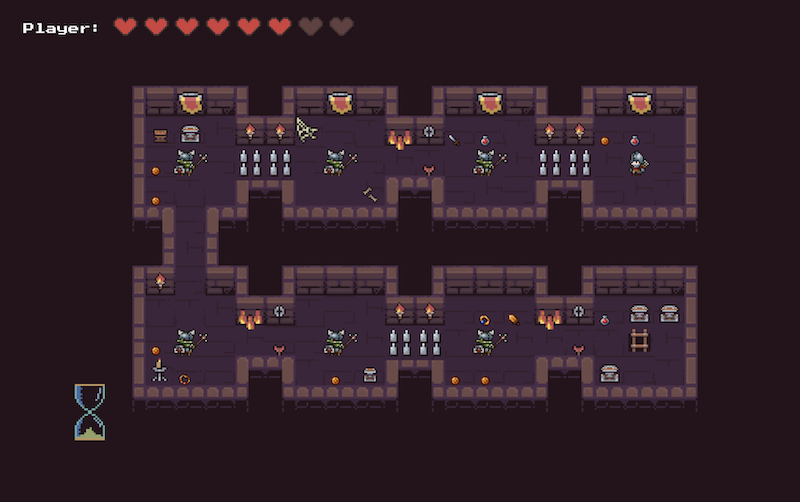

# Knight: The Orc Slayer
A 2D action-adventure game built in C++ using SDL2, featuring combat, inventory systems, AI enemies, and level progression.

# Tech Stack
  - C++
  - SDL2

Textures used are from public websit

## Highlights:
- BFS-based enemy AI pathfinding
- Inventory & equipment system
- Combat with animations
- Delta Time & linear interpolation movement
- OOP Design

## Features:

## Gameplay
- 5 Levels with progression via Ladder
- Between each level is a shop
- Can't progress to next level if all Enemies aren't cleared

## Shop
- Run by Shopkeeper
- Separate UI for Shop
- Can Buy/Sell things

## Inventory
- Separate UI for Inventory
- 35 Inventory Slots in 2 Dimensions ( 7 X 5 )
- Armory:
  - Rings (Increases Max Health Points)
  - Trinkets (Increases Special Ability Damage and Healing) 
  - Swords (Increases Attack Points/Power)
  - There are multiple types of each item
  
## Enemies (Orc)
- Ascending Difficulty, every odd level
- Boss with 3 attacking animations
- Breadth First Search Pathfinding
- Vision (Player Detection System)
- Drops loot on kill

## Player
- Attributes (Stats):
  - Max Health Points
  - Attack Points
  - Coins (in-game money)
- Special Attack (Earthquake)
  - Cooldown-based (delta-time - Hourglass)

## Hourglass
- Represents when player can perform Special Attack

## Movement
- Linear Interpolation Movement
- Delta-time based animations

## Screens
- Transitions between:
  - Introduction 
  - Game-Over
  - You-Win
  - Levels

## Environment
- Traps:
  - Shooting Arrow
  - Flamethrower
  - Needles

## Box and Chest
- Drops certain Loot according to Boxes Quality

## Doors
- Requires key to unlock, except on first level

## Keys
- Silver Key
  - unlocks Vertical Doors
- Gold Key
  - unlocks Horizontal Doors

## Controls
- TAB -> Opens Control Menu
- WASD / Arrows -> Movement
- Enter -> open/use Doors/Ladder
- K -> Special Ability 
- E -> Inventory

## Animations
- Map Objects
  - Traps
  - Torches
  - Lights
  - Banners
  - Chests
  - Boxes
  - Keys
- Enemies / Player
  - Idle
  - Death
  - Walking
  - Attacking
  - Special Attack
    - Boss has them, regular enemy doesn't
  - Hurt / Taking Damage

## Consumables
- Potion
  - Restores Health
- Mushroom
  - Loses Health

## Decorations
- Big Cobweb
- Small Cobweb
- Chains
- Different Floor Textures
- Skulls 
- Bones

## Performance
- 60 FPS cap

## Pictures / Examples 

## Fourth Level

  
  

